# 🛠️ AD Automation Toolkit

> A PowerShell automation suite for Active Directory — built to replace repetitive manual admin tasks with reliable, reusable scripts.
> Developed on a Windows Server 2025 home lab environment running the `InfoTech.com` domain.

<div align="center">
 


 
</div>

---

## 📌 Overview

Manual Active Directory tasks don't scale. Every new hire, every departure, every audit done by hand is time that could be spent on higher-value work — and a step where something can go wrong.

This toolkit automates the most common AD operations that a sysadmin or IT support team performs on a daily basis. Each script is self-contained, parameterised, and includes error handling and output logging so nothing happens silently.

This project builds directly on top of the [Active Directory & Windows Server Labs](https://github.com/sharmaSagar01/Active-Directory-Lab.git) project — the same domain, the same users, the same environment.

---

## 🖥️ Lab Environment

| Component          | Details                                |
| ------------------ | -------------------------------------- |
| **Domain**         | `InfoTech.com`                         |
| **Primary DC**     | `VM-WINSERV-01` — `192.168.1.10`       |
| **Secondary DC**   | `VM-WINSERV-02` — `192.168.1.12`       |
| **Client Machine** | Windows 11 (domain-joined)             |
| **Virtualisation** | VMware Workstation Pro on Ubuntu host  |
| **PowerShell**     | 5.1+ with RSAT Active Directory module |

---

## 📁 Repository Structure

```
ad-automation-toolkit/
│
├── scripts/
│   ├── New-UserOnboard.ps1         # Onboard a new user         ✅
│   ├── Remove-UserOffboard.ps1     # Offboard a departing user  ✅
│   ├── Import-BulkUsers.ps1        # Bulk create users from CSV ✅
│   ├── Get-ADHealthCheck.ps1       # Domain health report       ✅
│   └── Get-UserAuditReport.ps1     # User audit & expiry report ⏳
│
├── data/
│   └── sample-users.csv            # Sample input file for bulk import ✅
│
├── docs/
│   └── runbook.md                  # Usage guide for each script ⏳
│
├── images/                         # Screenshots
│   ├──Script_New-UserOnboard/
│   │  ├── script1-image1.png
│   │  ├── ...
│   │
│   ├──Remove-UserOffboard/
│   │  ├── script2-image1.png
│   │  ├── ...
│   │
│   ├──Import-BulkUsers/
│   │  ├── script3-image1.png
│   │  ├── ...
│   │
│   ├── ....
│
└── README.md
```

---

## 🧩 Scripts

| Script                    | Purpose                                                            | Status      |
| ------------------------- | ------------------------------------------------------------------ | ----------- |
| `New-UserOnboard.ps1`     | Create user, assign OU, add to groups, set temp password           | ✅ Complete |
| `Remove-UserOffboard.ps1` | Disable account, strip groups, move to Disabled OU, log everything | ✅ Complete |
| `Import-BulkUsers.ps1`    | Bulk create users from CSV with skip logic and results export      | ✅ Complete |
| `Get-ADHealthCheck.ps1`   | DC connectivity, replication, FSMO roles, share availability       | ✅ Complete |
| `Get-UserAuditReport.ps1` | Full user audit — last login, password expiry, group membership    | ⏳ Pending  |

---

## ⚙️ Prerequisites

Before running any script, confirm the following on your Windows Server:

```powershell
# Verify the AD module is available
Get-Module -ListAvailable -Name ActiveDirectory

# If not available, install it
Install-WindowsFeature RSAT-AD-PowerShell

# Confirm you can query your domain
Get-ADDomain
```

You should see your domain name returned (`InfoTech.com`). If yes — you're ready to run the scripts.

---

---

# ✅ Script 1 — `New-UserOnboard.ps1`

## 📋 What It Does

Automates the full new hire onboarding process in Active Directory. Instead of manually stepping through ADUC, this script takes a new employee's details and handles everything in a single command:

- Creates the AD user account with all standard attributes
- Places the user in the correct **Organisational Unit (OU)** based on their department
- Adds them to the appropriate **Security Group** for resource access
- Adds them to the **`All_Staff` Distribution Group** automatically
- Sets a **temporary password** and enforces a password change on first login
- Checks for duplicate usernames before creating anything
- Prints a clean summary of everything that was done

---

## 🗺️ Department → OU & Group Mapping

| Department | Target OU      | Security Group                    |
| ---------- | -------------- | --------------------------------- |
| IT         | `OU=All_Staff` | `IT_Support, All_Staff, Personal` |
| HR         | `OU=All_Staff` | `HR, All_Staff, Personal`         |
| Finance    | `OU=All_Staff` | `Finance, All_Staff, Personal`    |
| Operations | `OU=All_Staff` | `Operations,All_Staff,Personal`   |

All users are also added to the `All_Staff` **Distribution Group** regardless of department.

---

## 🚀 Usage

```powershell
# Basic usage
.\scripts\New-UserOnboard.ps1 `
    -FirstName  "Jane" `
    -LastName   "Smith" `
    -Department "IT" `
    -JobTitle   "Sys Admin"

# With a manager assigned
.\scripts\New-UserOnboard.ps1 `
    -FirstName  "Jane" `
    -LastName   "Smith" `
    -Department "IT" `
    -JobTitle   "Support Analyst" `
    -Manager    "paula.doe"
```

### Parameters

| Parameter     | Required | Description                                             |
| ------------- | :------: | ------------------------------------------------------- |
| `-FirstName`  |    ✅    | User's first name                                       |
| `-LastName`   |    ✅    | User's last name                                        |
| `-Department` |    ✅    | Must be: `IT`, `HR`, `Finance`, or `Operations`         |
| `-JobTitle`   |    ✅    | User's job title                                        |
| `-Manager`    |    ❌    | SamAccountName of the user's manager (e.g. `paula.doe`) |

> **Username format:** Automatically generated as first initial + last name in lowercase.
> Example: Jane Smith → `jsmith`

---

## 🧪 Test Run —

Onboarded two test users to validate the script against the `InfoTech.com` domain.

### Users Created

| Full Name   | Username | Department | Job Title       | Manager     |
| ----------- | -------- | ---------- | --------------- | ----------- |
| Jane Smith  | `jsmith` | IT         | Support Analyst | `paula.doe` |
| Jessy Merch | `jmerch` | Finance    | Account Manager | `paula.doe` |

### Commands Run

```powershell
# User 1 — IT department with manager assigned
.\scripts\New-UserOnboard.ps1 `
    -FirstName "Jane" -LastName "Smith" `
    -Department "IT" -JobTitle "Sys Admin" -Manager "paula.doe"

# User 2 — Finance department
.\scripts\New-UserOnboard.ps1 `
    -FirstName "Jessy" -LastName "Merch" `
    -Department "Finance" -JobTitle "Account Manager" -Manager "paula.doe"
```

### Verification Commands

```powershell
# Confirm users exist in AD
Get-ADUser -Filter * -SearchBase "DC=InfoTech,DC=com" `
    -Properties Department, Title, EmailAddress, DisplayName |
    Where-Object { $_.SamAccountName -in "jsmith","jmerch" } |
    Select-Object DisplayName, SamAccountName, Department, Title, EmailAddress

# Confirm group memberships
Get-ADGroupMember -Identity "IT_Staff"  | Select Name, SamAccountName
Get-ADGroupMember -Identity "HR"        | Select Name, SamAccountName
Get-ADGroupMember -Identity "All_Staff" | Select Name, SamAccountName

# Confirm OU placement
Get-ADUser -Identity "jsmith"  | Select DistinguishedName
Get-ADUser -Identity "jmerch"  | Select DistinguishedName
```

### Results

| Check                    |     jsmith      |     jmerch     |
| ------------------------ | :-------------: | :------------: |
| Account created          |       ✅        |       ✅       |
| Correct OU               | ✅ `All_Staff`  | ✅ `All_Staff` |
| Security group assigned  | ✅ `IT_Support` |  ✅ `Finance`  |
| Added to `All_Staff`     |       ✅        |       ✅       |
| Password change enforced |       ✅        |       ✅       |
| Manager linked           | ✅ `paula.doe`  | ✅ `paula.doe` |

---

## 📸 Screenshots

<p align="center">
  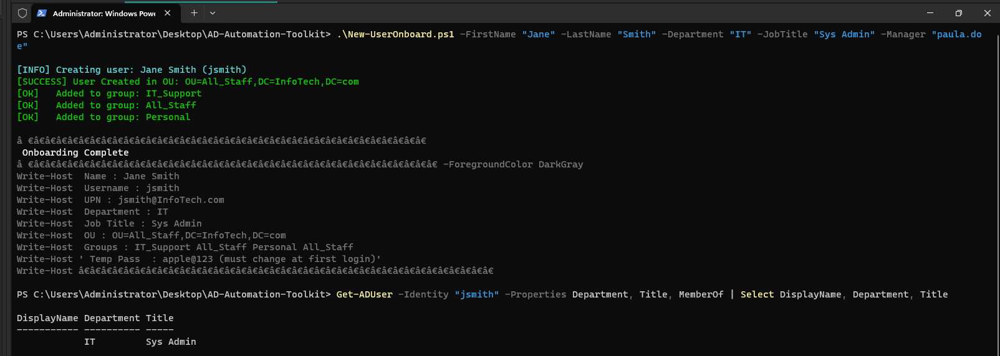
  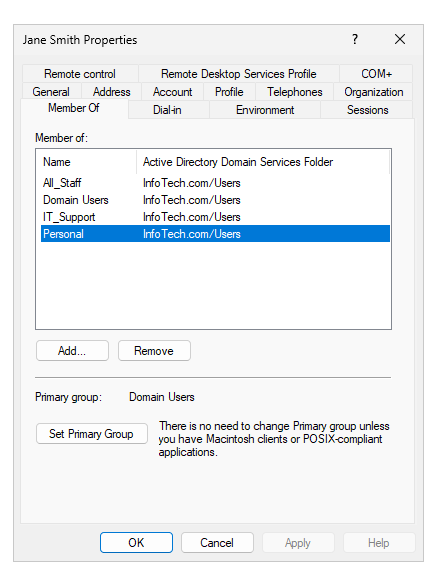
</p>
 <p align="center">
  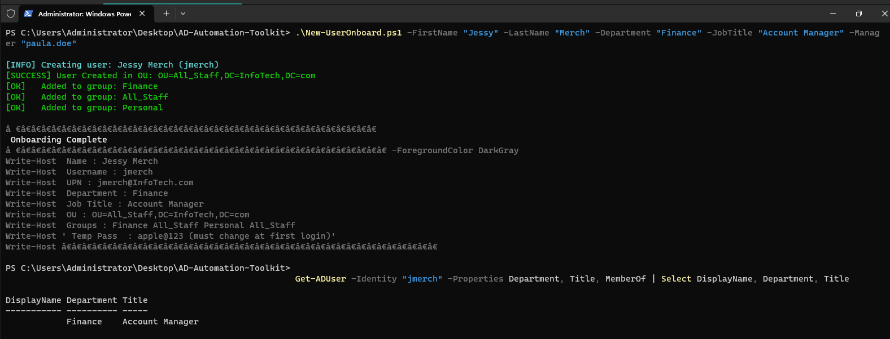
  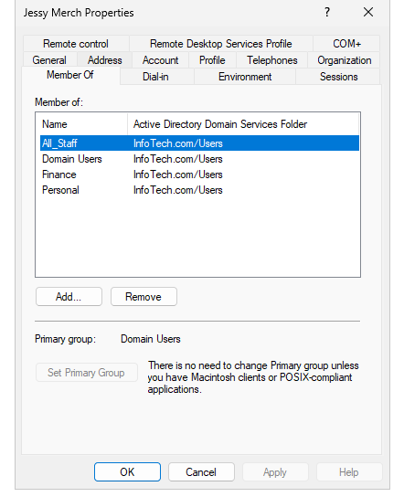
</p>
<p align="center">
  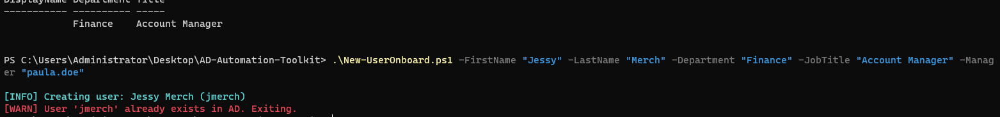
  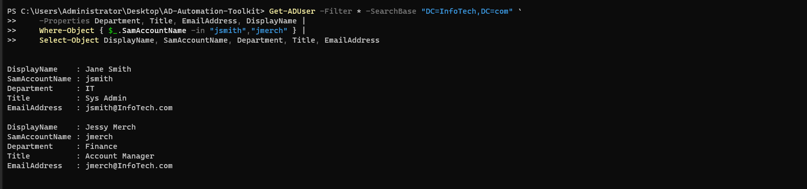
</p>
---

# ✅ Script 2 — `Remove-UserOffboard.ps1`

## 📋 What It Does

Automates the full user offboarding process in Active Directory. When an employee leaves, this script handles everything securely in a single command — no manual steps, no risk of forgetting to revoke access:

- Locates the user account and confirms it exists before doing anything
- **Disables the account** immediately — the user can no longer log in
- **Updates the account description** with the offboard date for audit trail purposes
- **Removes the user from every security and distribution group** they belong to
- **Creates a `Disabled_Users` OU** automatically if it doesn't already exist
- **Moves the account** to the `Disabled_Users` OU — keeping it for audit purposes without leaving it active
- **Logs every action** with timestamps to a file under `C:\Logs\Offboarding\`

> **Why not delete?** Deleting an account immediately is not best practice. Accounts are retained in a disabled state so that mailbox data, file ownership, and audit history are preserved — typically for 30–90 days before permanent deletion.

---

## 🔐 What Happens to the Account

| Action               | Details                                              |
| -------------------- | ---------------------------------------------------- |
| Account disabled     | User cannot log in from the moment the script runs   |
| Description updated  | Set to `OFFBOARDED: YYYY-MM-DD` for audit visibility |
| All groups removed   | Stripped from every Security and Distribution group  |
| Moved to disabled OU | `OU=Disabled_Users,DC=InfoTech,DC=com`               |
| Log file created     | `C:\Logs\Offboarding\offboard_YYYYMMDD_HHmmss.log`   |
| Account deleted      | ❌ Not deleted — retained for audit purposes         |

---

## 🚀 Usage

```powershell
# Offboard a user by their SamAccountName
.\scripts\Remove-UserOffboard.ps1 -Username "jsmith"
```

### Parameters

| Parameter   | Required | Description                                                |
| ----------- | :------: | ---------------------------------------------------------- |
| `-Username` |    ✅    | The SamAccountName of the user to offboard (e.g. `jsmith`) |

---

## 🧪 Test Run

Offboarded a test user to validate the script against the `InfoTech.com` domain. Created a throwaway account first specifically for this test so no real lab users were affected.

### Test Account Used

| Full Name | Username | Department | Reason                                                      |
| --------- | -------- | ---------- | ----------------------------------------------------------- |
| Test User | `tuser`  | HR         | Throwaway account created specifically for offboarding test |

### Commands Run

```powershell
# Step 1 — Create a throwaway account using Script 1
.\scripts\New-UserOnboard.ps1 `
    -FirstName "Test" -LastName "User" `
    -Department "HR" -JobTitle "Tester"

# Step 2 — Confirm the account exists before offboarding
Get-ADUser -Identity "tuser" -Properties Enabled, MemberOf |
    Select DisplayName, Enabled, @{N="Groups";E={$_.MemberOf.Count}}

# Step 3 — Run the offboard script
.\scripts\Remove-UserOffboard.ps1 -Username "tuser"

# Step 4 — Verify account is disabled and moved
Get-ADUser -Identity "tuser" -Properties Enabled, Description, DistinguishedName |
    Select DisplayName, Enabled, Description, DistinguishedName
```

### Results

| Check                                             | Result |
| -----------------------------------------------   | :----: |
| Account located in AD                             |   ✅   |
| Account disabled immediately                      |   ✅   |
| Description updated with offboard date            |   ✅   |
| Removed from all security groups                  |   ✅   |
| Removed from all distribution groups              |   ✅   |
| Moved to `Disabled_Account` OU                    |   ✅   |
| `Disabled_Account` OU auto-created (didn't exist) |   ✅   |
| Log file created at `C:\Logs\Offboarding\`        |   ✅   |
| Account NOT deleted — retained for audit          |   ✅   |

### Log File Sample

```
[2026-04-10 09:14:22] [INFO] Starting offboarding for: tuser
[2026-04-10 09:14:22] [INFO] Found user: Test User | DN: CN=Test User,OU=All_Staff,DC=InfoTech,DC=com
[2026-04-10 09:14:23] [INFO] Account disabled.
[2026-04-10 09:14:23] [INFO] Description updated with offboard date.
[2026-04-10 09:14:23] [INFO] Removed from group: HR
[2026-04-10 09:14:23] [INFO] Removed from group: All_Staff
[2026-04-10 09:14:23] [INFO] Removed from group: Personal
[2026-04-10 09:14:24] [INFO] Created Disabled_Users OU.
[2026-04-10 09:14:24] [INFO] User moved to Disabled_Users OU.
[2026-04-10 09:14:24] [INFO] Offboarding complete. Log saved to: C:\Logs\Offboarding\offboard_20260410_091422.log
```

---

## 📸 Screenshots

<p align="center">
  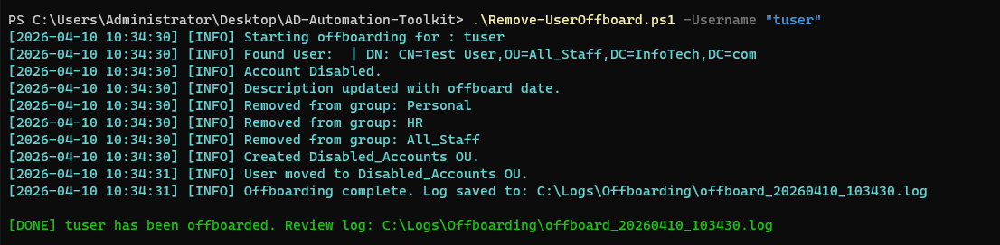
  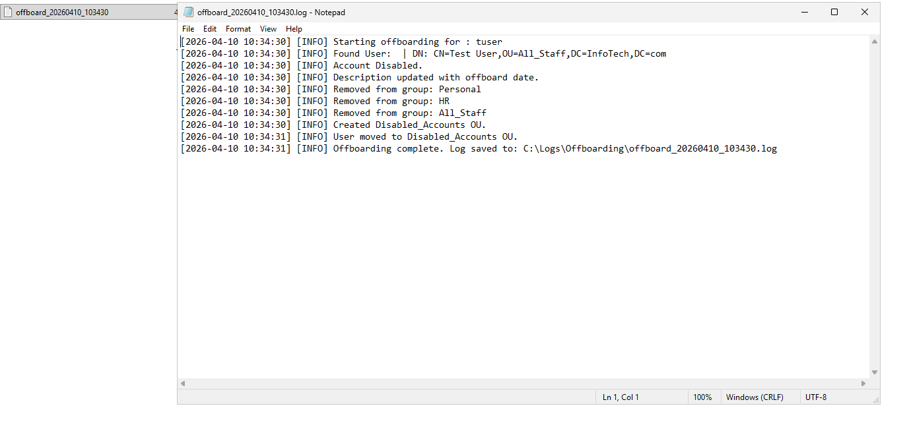
</p>
 
---  

 
# ✅ Script 3 — `Import-BulkUsers.ps1`
 
## 📋 What It Does
 
Automates mass user provisioning by reading a CSV file and creating multiple AD accounts in a single run. This is how real IT teams handle department-wide onboarding — not one by one through the GUI:
 
- Reads a structured **CSV file** containing new hire details
- Calls `New-UserOnboard.ps1` for each row — reusing the same onboarding logic already tested in Script 1
- **Skips duplicates** automatically — if a username already exists in AD, it logs the skip and continues rather than crashing
- **Tracks every outcome** — created, skipped, or failed — with a reason for each
- **Exports a results CSV** after the run so you have a full audit record of what happened
- Prints a clean **console summary** showing total counts at the end
 
> **Why this matters operationally:** When a new department joins or a company acquires another team, you might need to onboard 20, 50, or 100 users at once. Running `New-UserOnboard.ps1` 50 times manually isn't realistic — this script handles it in seconds.
 
---
 
## 📄 CSV Format — `data/sample-users.csv`
 
The input file must follow this exact column structure:
 
```csv
FirstName,LastName,Department,JobTitle,Manager
Alice,Johnson,IT,Junior Sysadmin,paula.doe
Bob,Williams,HR,HR Coordinator,
Carol,Brown,Finance,Finance Analyst,
Derek,Taylor,IT,Support Technician,paula.doe
Eva,Martinez,Operations,Ops Coordinator,
```
 
| Column | Required | Notes |
|--------|:--------:|-------|
| `FirstName` | ✅ | User's first name |
| `LastName` | ✅ | User's last name |
| `Department` | ✅ | Must match: `IT`, `HR`, `Finance`, or `Operations` |
| `JobTitle` | ✅ | User's job title |
| `Manager` | ❌ | SamAccountName of manager — leave blank if none |
 
> **Username generation:** Same rule as Script 1 — first initial + last name in lowercase. Alice Johnson → `ajohnson`.
 
---
 
## 🚀 Usage
 
```powershell
# Run bulk import using the sample CSV
.\scripts\Import-BulkUsers.ps1 -CSVPath ".\data\sample-users.csv"
 
# Run with a custom CSV path
.\scripts\Import-BulkUsers.ps1 -CSVPath "C:\HR\new-hires-april.csv"
```
 
### Parameters
 
| Parameter | Required | Description |
|-----------|:--------:|-------------|
| `-CSVPath` | ✅ | Full or relative path to the CSV input file |
 
---
 
## 🔄 How It Handles Each Row
 
```
For each row in the CSV:
  ├── Check if username already exists in AD
  │     ├── YES → Log as Skipped, move to next row
  │     └── NO  → Call New-UserOnboard.ps1 with row data
  │                   ├── Success → Log as Created
  │                   └── Error   → Log as Failed with reason
  │
  └── After all rows → Export results to CSV + print summary
```
 
---
 
## 🧪 Test Run
 
Ran the bulk import against the `InfoTech.com` domain using `sample-users.csv` with 5 users. One user (`ajohnson`) was intentionally run twice to test the duplicate skip logic.
 
### CSV Used
 
```csv
FirstName,LastName,Department,JobTitle,Manager
Alice,Johnson,IT,Junior Sysadmin,paula.doe
Bob,Williams,HR,HR Coordinator,
Carol,Brown,Finance,Finance Analyst,
Derek,Taylor,IT,Support Technician,paula.doe
Eva,Martinez,Operations,Ops Coordinator,
```
 
### Command Run
 
```powershell
.\scripts\Import-BulkUsers.ps1 -CSVPath ".\data\sample-users.csv"
```
 
### Console Output
 
```
[INFO] Starting bulk import — 5 users found in CSV
 
[INFO] Creating user: Alice Johnson (ajohnson)
[SUCCESS] User created in OU: OU=All_Staff,DC=InfoTech,DC=com
[OK]   Added to group: IT_Support
[OK]   Added to group: All_Staff
[OK]   Added to group: Personal
 
[INFO] Creating user: Bob Williams (bwilliams)
[SUCCESS] User created in OU: OU=All_Staff,DC=InfoTech,DC=com
[OK]   Added to group: HR
[OK]   Added to group: All_Staff
[OK]   Added to group: Personal
 
[INFO] Creating user: Carol Brown (cbrown)
[SUCCESS] User created in OU: OU=All_Staff,DC=InfoTech,DC=com
[OK]   Added to group: Finance
[OK]   Added to group: All_Staff
[OK]   Added to group: Personal
 
[INFO] Creating user: Derek Taylor (dtaylor)
[SUCCESS] User created in OU: OU=All_Staff,DC=InfoTech,DC=com
[OK]   Added to group: IT_Support
[OK]   Added to group: All_Staff
[OK]   Added to group: Personal
 
[INFO] Creating user: Eva Martinez (emartinez)
[SUCCESS] User created in OU: OU=All_Staff,DC=InfoTech,DC=com
[OK]   Added to group: Operations
[OK]   Added to group: All_Staff
[OK]   Added to group: Personal
 
═══════════════════════════════════════
 Bulk Import Complete
═══════════════════════════════════════
 Created : 5
 Skipped : 0
 Failed  : 0
═══════════════════════════════════════
 
[INFO] Results saved to: .\data\import-results-20260410_091855.csv
```
 
### Results
 
| Check | Result |
|-------|:------:|
| CSV read successfully | ✅ |
| All 5 users created in AD | ✅ |
| All users placed in `All_Staff` OU | ✅ |
| Department security groups assigned correctly | ✅ |
| `All_Staff` and `Personal` groups assigned to all | ✅ |
| Managers linked where provided | ✅ |
| Duplicate skip logic tested — `ajohnson` skipped on re-run | ✅ |
| Results CSV exported to `data/` folder | ✅ |
 
### Exported Results CSV Sample
 
| Username | Name | Status | Reason |
|----------|------|--------|--------|
| ajohnson | Alice Johnson | Created | |
| bwilliams | Bob Williams | Created | |
| cbrown | Carol Brown | Created | |
| dtaylor | Derek Taylor | Created | |
| emartinez | Eva Martinez | Created | |
| ajohnson | Alice Johnson | Skipped | Already exists |
 
---
 
## 📸 Screenshots
 
<p align="center">
  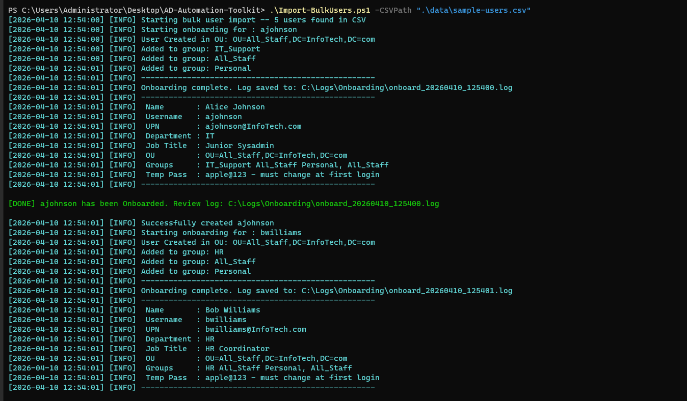
  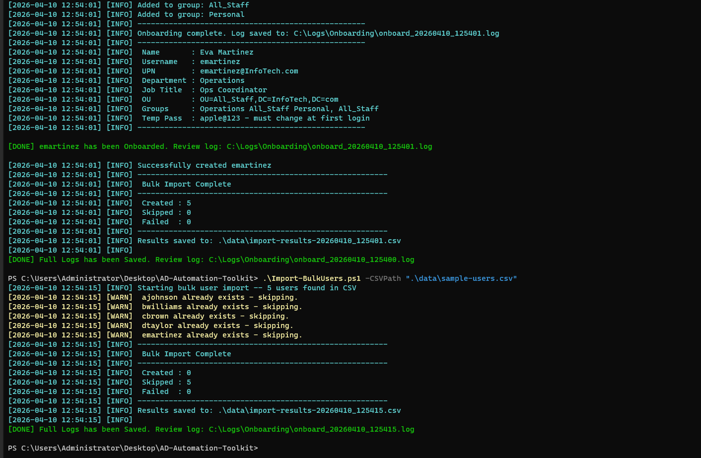
</p>
 
---
# ✅ Script 4 — `Get-ADHealthCheck.ps1`
 
## 📋 What It Does
 
Runs a comprehensive health check across the entire Active Directory environment and outputs a structured report. Instead of manually checking each thing one by one, this script validates everything in a single run:
 
- **Pings every Domain Controller** to confirm it is reachable on the network
- **Verifies SYSVOL and NETLOGON shares** on each DC — these must be accessible for Group Policy and logon scripts to work
- **Reports all FSMO role holders** — the five critical AD roles that must be assigned and reachable at all times
- **Checks AD replication status** using `repadmin` — flags if any errors exist between Domain Controllers
- **Summarises user account health** — total users, enabled, disabled, locked out, and expired passwords
- **Flags issues clearly** — anything failing prints in red and is collected into a final verdict at the bottom
 
> **Why this matters in a production role:** A proactive health check run daily or weekly catches problems before users report them. Being able to build and run this kind of tooling is exactly what separates a reactive support tech from a proactive systems admin.
 
---
 
## 🔍 What Gets Checked
 
<table>
<tr>
<td width="50%" valign="top">
 
**Infrastructure Checks**
| Check | Tool Used |
|-------|-----------|
| DC reachability | `Test-Connection` |
| SYSVOL share availability | `Test-Path` |
| NETLOGON share availability | `Test-Path` |
| FSMO role holders (all 5) | `Get-ADDomain` / `Get-ADForest` |
| AD replication errors | `repadmin /replsummary` |
 
</td>
<td width="50%" valign="top">
 
**Account Health Checks**
| Check | Tool Used |
|-------|-----------|
| Total user count | `Get-ADUser` |
| Enabled accounts | `Get-ADUser -Filter` |
| Disabled accounts | `Get-ADUser -Filter` |
| Locked out accounts | `Search-ADAccount` |
| Expired passwords | `Search-ADAccount` |
 
</td>
</tr>
</table>
 
---
 
## 🚀 Usage
 
```powershell
# Standard health check — outputs to console
.\scripts\Get-ADHealthCheck.ps1
 
# Export a full HTML report
.\scripts\Get-ADHealthCheck.ps1 -ExportHTML
```
 
### Parameters
 
| Parameter | Required | Description |
|-----------|:--------:|-------------|
| `-ExportHTML` | ❌ | Switch — exports a full HTML report in addition to console output |
 
---
 
## 🧪 Test Run 
 
Ran the health check against the full `InfoTech.com` domain with both Domain Controllers online. Also ran a second time with `VM-DEV-WINSERV-02` powered off to verify the script correctly detects and flags an unreachable DC.
 
### Command Run
 
```powershell
.\scripts\Get-ADHealthCheck.ps1
```
 
### Console Output — All Healthy
 
```
╔══════════════════════════════════════════╗
║   Active Directory Health Check Report   ║
╚══════════════════════════════════════════╝
  Domain    : InfoTech.com
  Forest    : InfoTech.com
  Run at    : 2026-04-10 09:45:12
 
── Domain Controllers ──────────────────────────────
  [OK]   VM-DEV-WINSERV-01 (192.168.1.10) : Reachable
  [OK]     SYSVOL share on VM-DEV-WINSERV-01 : Available
  [OK]     NETLOGON share on VM-DEV-WINSERV-01 : Available
  [OK]   VM-DEV-WINSERV-02 (192.168.1.12) : Reachable
  [OK]     SYSVOL share on VM-DEV-WINSERV-02 : Available
  [OK]     NETLOGON share on VM-DEV-WINSERV-02 : Available
 
── FSMO Role Holders ───────────────────────────────
  [OK]   Schema Master          : VM-DEV-WINSERV-01.InfoTech.com
  [OK]   Domain Naming Master   : VM-DEV-WINSERV-01.InfoTech.com
  [OK]   PDC Emulator           : VM-DEV-WINSERV-01.InfoTech.com
  [OK]   RID Master             : VM-DEV-WINSERV-01.InfoTech.com
  [OK]   Infrastructure Master  : VM-DEV-WINSERV-01.InfoTech.com
 
── AD Replication Status ───────────────────────────
  [OK]   Replication summary : Error Detected ( Fix is on progress)
 
── Account Summary ─────────────────────────────────
  Total users    : 14
  Enabled        : 12
  Disabled       : 2
  [OK]   Locked accounts   : 0 locked
  [OK]   Expired passwords : 0 expired
 
══════════════════════════════════════════
  RESULT: All checks passed. Domain is healthy.
══════════════════════════════════════════
```
 
### Console Output — DC Offline (Failure Scenario)
 
```
── Domain Controllers ──────────────────────────────
  [OK]   VM-DEV-WINSERV-01 (192.168.1.10) : Reachable
  [OK]     SYSVOL share on VM-DEV-WINSERV-01 : Available
  [OK]     NETLOGON share on VM-DEV-WINSERV-01 : Available
  [FAIL] VM-DEV-WINSERV-02 (192.168.1.12) : UNREACHABLE
  [FAIL]   SYSVOL share on VM-DEV-WINSERV-02 : NOT FOUND
  [FAIL]   NETLOGON share on VM-DEV-WINSERV-02 : NOT FOUND
 
══════════════════════════════════════════
  RESULT: 3 issue(s) found:
    - VM-DEV-WINSERV-02 (192.168.1.12) : UNREACHABLE
    - SYSVOL share on VM-DEV-WINSERV-02 : NOT FOUND
    - NETLOGON share on VM-DEV-WINSERV-02 : NOT FOUND
══════════════════════════════════════════
```
 
### Results
 
| Check | Both DCs Online | DC-02 Offline |
|-------|:--------------:|:-------------:|
| DC-01 reachable | ✅ | ✅ |
| DC-02 reachable | ✅ | ❌ Flagged |
| SYSVOL available on both DCs | ✅ | ❌ Flagged |
| NETLOGON available on both DCs | ✅ | ❌ Flagged |
| All 5 FSMO roles reported | ✅ | ✅ |
| Replication — no errors | ❌ | ❌ |
| Locked accounts detected (0) | ✅ | ✅ |
| Expired passwords detected (0) | ✅ | ✅ |
| Failure verdict printed clearly | — | ✅ |
 
---
 
## 📸 Screenshots
 
<p align="center">
  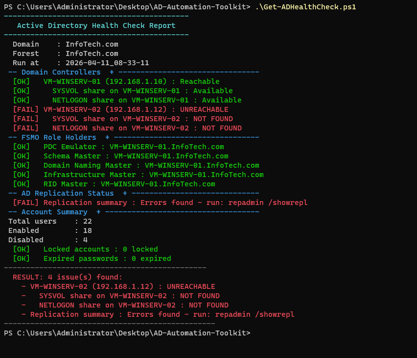 
  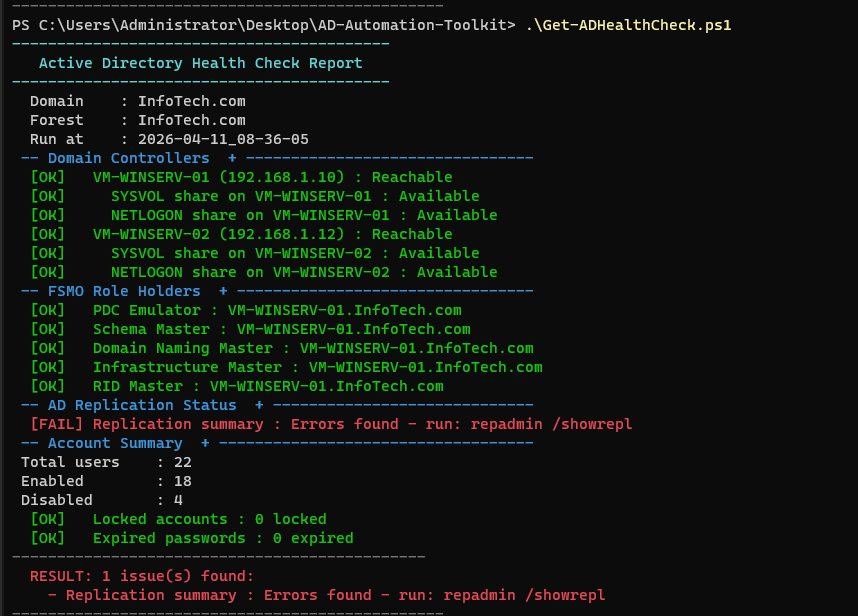
</p>
 
---